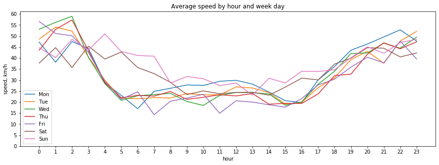

## Computation Graph Library

### Overview
This library is designed for computations on graphs, providing tools for creating and utilizing computational graphs.
A computational graph is understood as a predefined sequence of operations that can be applied to different datasets.
Data is represented in tabular format: a table is a sequence of dictionaries, where each dictionary corresponds to a row in the table and the keys of the dictionary represent the table's columns.

### Graph Interface
The computational graph consists of entry points for data and operations performed on them. For an example, see `graphs.py`, which includes a graph that counts the number of words in documents.

The graph interface allows each operation to be specified through a call to the corresponding method of the `Graph` class (for a complete list of operations, refer to `lib/graph.py`).

Typically, operations are invoked sequentially, but there are also operations (e.g., `join`) that accept other computational graphs as input. This enables the overall computational graph to be nonlinear.

### Examples of Tasks Solved with This Library

#### 1. Calculate Metrics on Words:
- Given a table with rows formatted as `{'doc_id': ..., 'text': ...}`, the objective is to count the occurrences of each word found in the `text` column across the entire table.
- Build a data structure that stores a list of documents in which each word appears, sorted by relevance, determined by TF-IDF metric.
- Compute the top n words that are most characteristic of each document using the Pointwise Mutual Information (PMI) metric.

#### 2. Average Speed of Urban Traffic

Construct a table that lists the average speed of vehicles based on the hour of the day and the day of the week, utilizing traffic movement data. The streets are represented as a graph, while the movement data is provided in table format, with each row containing information such as:

```plaintext
{'edge_id': '624', 'enter_time': '20170912T123410.1794', 'leave_time': '20170912T123412.68'}
```
- **edge_id**: The identifier for the roadway segment.
- **enter_time** and **leave_time**: The UTC time a vehicle enters and exits the segment.

Additionally, a supplementary table is provided in the following format:

```plaintext
{'edge_id': '313', 'length': 121, 'start': [37.31245, 51.256734], 'end': [37.31245, 51.256734]}
```
- **length**: The length of the segment in meters.
- **start** and **end**: The coordinates of the start and end points of the segment.

Visualization of Average Speed:



### Directory Structure
- **`lib`**: Contains the interfaces for the computational graph and the requisite operations.
- **`examples`**: Provides practical examples demonstrating how to use the graph with text or maps data.
- **`test`**: Houses tests specifically written for the examples provided, ensuring functionality and reliability.
- **`data`**: Contains data in tabular form for extraction.